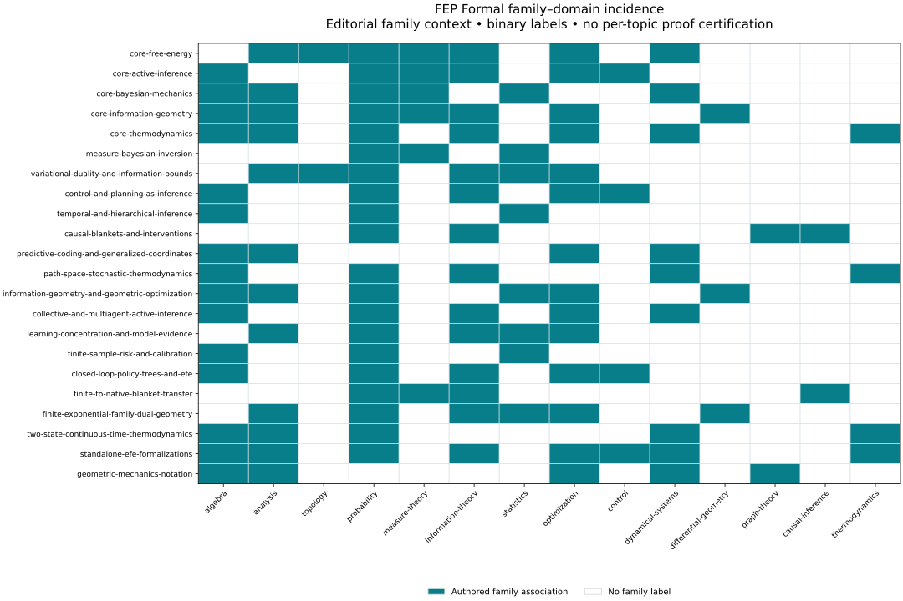

# OpenAI math context and FEP Formal methods

This slice places the canonical FEP Formal catalogue in overlapping mathematical
domains and preserves the contracts that make each association meaningful. It
supports the [manuscript supplement](../../manuscript/08b_mathematical_positioning_supplement.md)
and [upstream review](REVIEW.md). The upstream OpenAI repository is a research
corpus; the integration is an optional source-reference workflow, with the
reviewed revision recorded in [upstream.lock.json](upstream.lock.json).

The 1.6.0 continuation moves reusable methods into the portable
`fep_lean.methods` package. [The guide](../../docs/mathematical-methods.md)
and [integration acceptance](INTEGRATION.md) document that surface.
[Local validation](VALIDATION.md) records the continuation's separate evidence lanes.
Its complete
[offline explorer](../../docs/mathematical-positioning/mathematical-map.html)
retains topic contracts, typed relations and capability evidence alongside
the seven original logical visual views. Three separate relation panels provide readable
print layers. Supplement A adds Lean contract analysis and a common authored
feature representation of the 22 FEP family contexts and 12 selected OpenAI
results. Its twelve cited publication figures sit within a 17-product export
with thirteen SVGs. The combined relation overview serves the offline explorer.
The initial slice prototype below remains an
independently reproducible source-review artifact.

The methods module neither imports that corpus as a Python dependency nor
executes its research code. It adds no Lean declaration, native receipt,
Hermes/OpenGauss execution, scientific acceptance, or semantic promotion.

## Retained products

- [positioning.yaml](positioning.yaml) is the authored taxonomy: 22 family
  classifications along mathematical domains, carriers, scale, topology,
  embedding, statistics, and boundaries. The classifications summarize reviewed
  invariants and actual family-owned Lean bodies; they are not inferred from
  titles, shared imports, or a language-model similarity score.
- [positioning.md](positioning.md) is the readable generated projection. It
  includes every canonical topic's invariant, assumption review, non-vacuity,
  acceptance-probe requirement, semantic disposition, and exact primary,
  supporting, and boundary theorem references.
- [positioning.json](positioning.json) retains the full joined data, all authored
  relation edges and capabilities, the complete manifested formal-module
  inventory, explicit feature coordinates, numerical probes, and source hashes.
- [family-domains.svg](family-domains.svg) renders the same binary incidence
  model as an accessible static SVG. It labels editorial family context, and
  the full textual table remains in `positioning.md`.
- [methods.py](methods.py) contains separate source-validation, theorem-resolution,
  positioning, feature-representation, numerical-probe, rendering, and freshness
  functions. This initial prototype remains slice-local. The 1.6.0 package
  implementation and renderer are separate maintained owners in the coordinated
  source-manifest refresh; package code does not import this slice.

Every topic's domain list has `classification_scope: inherited_family_context`.
A family can combine measurable kernels, finite matrices, and scalar calculus;
an individual topic does not therefore prove all three. Its copied semantic
contract and qualified Lean declarations remain the precise reference. The
continuous Gaussian, smooth-chart, OU/linear semigroup, Gaussian conditioning,
and H3 reference-model modules receive separate source-based scope notes. Their
presence prevents finite catalogue examples from being mistaken for the entire
repository's continuous native scope; these notes do not refresh their acceptance
evidence.

## Portable package and complete visuals

```bash
uv run python specs/openai-math-methods/generate_package_methods.py --check
uv run fep-lean --project-root . methods inspect --topic fep-001
uv run fep-lean --project-root . methods analyze fep-001
uv run fep-lean --project-root . methods embedding
uv run fep-lean --project-root . methods export --output-root docs/mathematical-positioning
uv run fep-lean --project-root . methods check --output-root docs/mathematical-positioning
uv run python specs/openai-math-methods/visualization.py --check
uv run pytest tests/test_mathematical_methods.py specs/openai-math-methods/test_visualization.py -q --no-cov
```

`visualization.py` is a thin slice wrapper over the package renderer and its
validated checkout model. The installed export labels its own source origin
and version and preserves the same canonical records. The original prototype
`methods.py` projections remain a bounded historical analysis surface.
Checks compare their declared products without repairing existing bytes.

## Offline commands

Run from the repository root with its accepted Python 3.14 environment:

```bash
uv run python specs/openai-math-methods/methods.py
uv run python specs/openai-math-methods/methods.py --check
uv run python specs/openai-math-methods/methods.py \
  --neighbors core-information-geometry --limit 5
uv run pytest specs/openai-math-methods/test_methods.py -q --no-cov
uv run ruff check specs/openai-math-methods/methods.py \
  specs/openai-math-methods/test_methods.py
uv run ruff format --check specs/openai-math-methods/methods.py \
  specs/openai-math-methods/test_methods.py
```

The first command writes only the three retained projections in this directory.
`--check` compares exact bytes and returns a failure on drift or missing
artifacts; it does not rewrite them or create directories. The neighbor query
prints a transient candidate list and leaves files unchanged. Outputs contain
no wall-clock timestamp, absolute workstation paths, or remote credentials.
Source changes during projection fail the run; hashes are informational source
snapshots, not a continuous custody or native compilation claim.

The optional upstream adapter is also offline. A default check validates only
the retained lock. Supplying an independently acquired checkout additionally
compares its root/HEAD and the selected reviewed bytes:

```bash
uv run python specs/openai-math-methods/upstream.py --check
uv run python specs/openai-math-methods/upstream.py --check \
  --upstream-root /path/to/reviewed-openai-math
uv run pytest specs/openai-math-methods/test_methods.py \
  specs/openai-math-methods/test_upstream.py -q --no-cov
```

The adapter runs no upstream hooks, Lean code, or network acquisition. It does
not attest unreviewed files or continuous snapshot custody; see the
[integration decision and review](REVIEW.md).



The generator invokes the repository's existing roster, semantic, ownership,
formal-graph, and declaration validators. It also rejects duplicate YAML keys,
missing/duplicate/unknown families and topics, unknown domain references,
unmanifested continuous scope entries, and dangling reviewed, capability, or
edge-witness theorem references. Literal family source mappings must match the
imported canonical registry; stale imported bodies and duplicate literal body
keys fail rather than being regenerated into a misleading projection.

## Modular mathematical method

1. Locate the exact carrier and codomain: finite law, weighted Dirac measure,
   native measure, scalar chart, finite matrix, path law, or Gaussian semigroup.
   Record whether an information functional is real-valued and totalized or
   extended-real, and whether time or state is continuous.
2. Read the topic's theorem contract and its complete assumption review. Match
   normalization, support, positivity, rank, evidence, finite horizon, and
   almost-everywhere qualifications before attempting a mathematical transfer.
3. Use the family-domain feature space to retrieve reading candidates. Its
   vectors have one binary coordinate per authored domain. Jaccard similarity
   divides shared coordinates by union coordinates, with every domain equally
   weighted. These are editorial comparison candidates, not learned embeddings,
   manifold coordinates, theorem implications, or proof dependencies.
4. Inspect existing authored relations. Preserve `formal`, `formal_pairing`,
   `conceptual`, and `blocked_by` as different kinds. The present roster need not
   instantiate every kind. A pairing conjunction does not become a derivational
   edge, and similarity never supplies a Lean witness.
5. State a proposed bridge as a carrier map and an explicit preservation law,
   identify its failure cases, and only then pursue a new formal declaration and
   the repository's separately governed native and scientific gates. Upstream
   mathematical problems can motivate that proposal; a corpus entry does not
   discharge any assumption or acceptance gate.

## Boundary probes and interpretation

The numerical examples are finite diagnostics implemented in this module. The
two probability-vector functions require nonnegative finite values and a unit
sum within an explicit absolute floating-point tolerance of `1e-12`; this is a
numeric input check rather than a relaxation of a Lean premise.

- Bernoulli Fisher information is evaluated only for `0 < p < 1`. Endpoints and
  nonfinite parameters are refused; a finite mathematical interior weight that
  exceeds the float range is separately refused without moving the parameter.
  Finite Fisher–Rao coordinate distance at an
  endpoint does not imply a regular endpoint Fisher tensor.
- Disjoint Boolean point masses give `1` under the maintained totalized
  `q * klFun(p/q)` finite convention and infinity under conventional extended
  discrete KL. The numerical probe mirrors the named finite boundary theorem;
  it does not execute Mathlib or validate a native KL bridge at missing support.
- Redundant three-state logit coordinates have a common-offset null direction,
  while the law-coordinate Fisher pairing is positive on a nonzero mass-zero
  simplex tangent. These are different coordinate representations, so rank and
  tangent-carrier premises matter.
- Descent for `f(x,y)=x²` under `(x,y) → (x/2,y)` leaves the unobserved coordinate
  unchanged. Equal decreasing objective values can converge to distinct states;
  descent alone does not establish identifiability, a unique state, or an FEP
  interpretation.

The tests check the actual canonical join, complete semantic-field retention,
unchanged edge data, deterministic rendering, byte drift without repair,
malformed classifications and source mappings, dangling references in every
theorem lane, and the numerical boundaries. Successful tests establish this
offline analysis module's behavior only.
